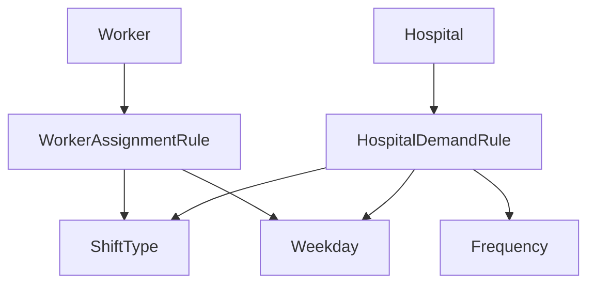

# Domain Types API Documentation

This document provides comprehensive documentation for the core domain types used in the OptiRoster system.

## Overview

The domain layer defines the fundamental data structures and enums that represent the business concepts in the duty assignment system. These types are used throughout the application to ensure type safety and clear data modeling.

## Enums

### ShiftType

Represents the different types of work shifts available in the system.

```python
class ShiftType(str, Enum):
    DAY = "日勤"     # Day shift
    NIGHT = "当直"   # Night duty/on-call
    AM = "AM"        # Morning shift
    PM = "PM"        # Evening shift
```

**Usage:**

- Used to specify the type of shift in worker assignments and hospital demands
- String-based enum for easy serialization and configuration
- Japanese values for UI display compatibility

**Example:**

```python
shift = ShiftType.NIGHT
print(shift)  # Output: "当直"
```

### Weekday

Represents days of the week with Japanese localization.

```python
class Weekday(str, Enum):
    MONDAY = "月曜"
    TUESDAY = "火曜"
    WEDNESDAY = "水曜"
    THURSDAY = "木曜"
    FRIDAY = "金曜"
    SATURDAY = "土曜"
    SUNDAY = "日曜"
```

**Usage:**

- Used in assignment rules and demand specifications
- Enables Japanese-localized day representations
- Supports weekday-specific constraint logic

### Frequency

Defines how often a particular demand rule applies.

```python
class Frequency(str, Enum):
    WEEKLY = "毎週"      # Every week
    BIWEEKLY = "隔週"    # Every other week
    SPECIFIC_DAYS = "指定日"  # Specific designated days
```

**Usage:**

- Controls hospital demand scheduling patterns
- Supports flexible demand configuration
- Used in optimization constraint generation

## Data Classes

### WorkerAssignmentRule

Defines which assignments a worker can be scheduled for.

```python
@dataclass
class WorkerAssignmentRule:
    hospital: str                    # Hospital name
    weekdays: list[Weekday]         # Days of week worker can work
    shift_type: ShiftType           # Type of shift worker can handle
```

**Attributes:**

- `hospital`: Name of the hospital where the worker can be assigned
- `weekdays`: List of weekdays the worker is available
- `shift_type`: The type of shift the worker can perform

**Usage:**

- Represents worker availability constraints
- Used in constraint generation to limit valid assignments
- Enables flexible worker scheduling capabilities

**Example:**

```python
rule = WorkerAssignmentRule(
    hospital="Central Hospital",
    weekdays=[Weekday.MONDAY, Weekday.WEDNESDAY, Weekday.FRIDAY],
    shift_type=ShiftType.NIGHT
)
```

### Worker

Represents a healthcare worker who can be assigned to duties.

```python
@dataclass
class Worker:
    name: str                                    # Worker's name
    assignments: list[WorkerAssignmentRule]     # Possible assignments
    is_diagnostic_specialist: bool = False      # Specialist status
```

**Attributes:**

- `name`: Unique identifier/name for the worker
- `assignments`: List of possible assignment rules defining where and when the worker can work
- `is_diagnostic_specialist`: Boolean flag indicating if the worker is qualified for specialized duties (affects university hospital holiday night shifts)

**Usage:**

- Central entity in the optimization model
- Used to generate decision variables for assignments
- Specialist status affects constraint application

**Example:**

```python
worker = Worker(
    name="Dr. Smith",
    assignments=[
        WorkerAssignmentRule("Central Hospital", [Weekday.MONDAY], ShiftType.DAY),
        WorkerAssignmentRule("University Hospital", [Weekday.FRIDAY], ShiftType.NIGHT)
    ],
    is_diagnostic_specialist=True
)
```

### HospitalDemandRule

Defines when a hospital needs staffing coverage.

```python
@dataclass
class HospitalDemandRule:
    shift_type: ShiftType           # Type of shift needed
    weekdays: list[Weekday]         # Days when coverage is needed
    frequency: Frequency            # How often the rule applies
```

**Attributes:**

- `shift_type`: The type of shift requiring coverage
- `weekdays`: Days of the week when the shift is needed
- `frequency`: Scheduling frequency (weekly, biweekly, or specific days)

**Usage:**

- Defines hospital staffing requirements
- Used to generate demand constraints in optimization
- Supports flexible scheduling patterns

**Example:**

```python
demand = HospitalDemandRule(
    shift_type=ShiftType.NIGHT,
    weekdays=[Weekday.SATURDAY, Weekday.SUNDAY],
    frequency=Frequency.WEEKLY
)
```

### Hospital

Represents a healthcare facility requiring duty assignments.

```python
@dataclass
class Hospital:
    name: str                                # Hospital name
    is_remote: bool                         # Remote location flag
    is_university: bool                     # University hospital flag
    demand_rules: list[HospitalDemandRule]  # Staffing requirements
```

**Attributes:**

- `name`: Unique identifier/name for the hospital
- `is_remote`: Indicates if the hospital is in a remote location (affects post-night duty constraints)
- `is_university`: Indicates if this is a university hospital (affects specialist requirements)
- `demand_rules`: List of staffing demand patterns

**Usage:**

- Represents staffing demand points in the optimization
- Hospital flags affect constraint logic (remote location rules, university specialist requirements)
- Central to demand-side modeling

**Example:**

```python
hospital = Hospital(
    name="University Medical Center",
    is_remote=False,
    is_university=True,
    demand_rules=[
        HospitalDemandRule(ShiftType.NIGHT, [Weekday.FRIDAY], Frequency.WEEKLY),
        HospitalDemandRule(ShiftType.DAY, [Weekday.MONDAY, Weekday.TUESDAY], Frequency.WEEKLY)
    ]
)
```

## Type Relationships



## Design Principles

1. **Immutability**: All data classes use the `@dataclass` decorator for immutable data structures
2. **Type Safety**: Strong typing with explicit type hints throughout
3. **Localization**: Japanese string values for UI compatibility
4. **Flexibility**: Rule-based system allows complex scheduling patterns
5. **Constraint-Aware**: Design supports constraint system requirements

## Penalty Reporting System

### Constraint Summary Feature

Each constraint now includes a `summary` attribute that provides a human-readable description for penalty reporting:

```python
class ConstraintBase(ABC):
    name: str = "unnamed"                    # Constraint identifier
    summary: str = "no summary"              # Human-readable description
    requires: ClassVar[set[str]] = set()     # Required context keys
```

**Purpose:**

- Provides meaningful descriptions in penalty reports
- Enables users to understand which constraints are being violated
- Supports Japanese localization for constraint explanations

### Penalty Report Data Structure

The penalty reporting system uses the following data structure:

```python
@dataclass
class PenaltyItem:
    var: pulp.LpVariable       # Decision variable with penalty
    weight: float              # Penalty weight
    meta: dict[str, Any]       # Additional metadata  
    source: str               # Constraint name that generated penalty
```

**Report Generation:**

- Groups penalties by constraint summary for aggregate analysis
- Shows detailed breakdown of individual penalty items
- Calculates total penalty scores and constraint-wise totals
- Supports filtering and sorting by penalty severity

**Example Constraint Summary:**

```python
class RespectPreferencesFromCSV(ConstraintBase):
    name = "respect_preferences_from_csv"
    summary = "勤務希望.CSVの内容を遵守"  # "Honor preferences from CSV"
    requires: ClassVar[set[str]] = {"preferences"}
```

### Report Output Format

The penalty report system generates rich console output with:

1. **Summary Table**: Total penalties grouped by constraint summary
2. **Detail Table**: Individual penalty items with metadata
3. **Totals**: Overall penalty score and constraint-wise breakdowns

## Integration Notes

- These types are used throughout the constraint system for type checking
- String enum values are used in configuration files and UI
- Data classes support serialization for configuration loading
- Hospital and Worker flags enable specialized constraint logic
- Constraint summaries support multilingual penalty reporting
- Penalty system provides detailed debugging and optimization insights
