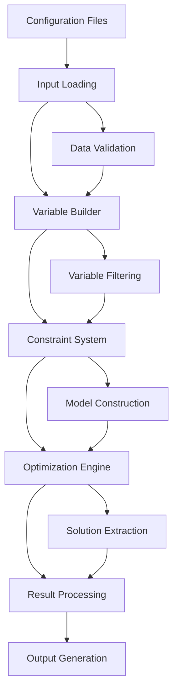

# Data Flow and Integration Patterns

This document describes the data flow through the OptiRoster system and integration patterns for external systems.

## Overview

The OptiRoster follows a pipeline architecture with distinct phases:

1. **Input Loading** - Configuration and data file parsing
2. **Variable Generation** - Decision variable creation and filtering
3. **Constraint Application** - Mathematical constraint generation
4. **Optimization** - PuLP solver execution
5. **Output Generation** - Result formatting and export



## Phase 1: Input Loading

### Data Sources

**Configuration Files (TOML)**

- `config/hospitals.toml` → `Hospital` objects
- `config/workers.toml` → `Worker` objects
- `data/specified-YYYY-MM.toml` → Specified day overrides

**Data Files (CSV)**

- `data/YYYY-MM.csv` → Worker preferences
- `data/max-assignments.csv` → Assignment limits

### Loading Pipeline

```python
# src/cli/main.py: build_and_solve()
hospitals = load_hospitals(hospitals_path)          # IO layer
workers = load_workers(workers_path)                # IO layer
specified_days = load_specified_days(specified_days_path)  # IO layer
preferences = load_preferences_csv(preferences_path)        # IO layer
max_assignments = load_max_assignments_csv(max_assignments_path)  # IO layer
days = generate_monthly_dates(year, month)          # Calendar utils
```

**Data Transformations:**

- TOML → Domain objects (Hospital, Worker)
- CSV → Dictionary mappings
- Date calculations → List[date]

### Validation Phase

Each loader performs validation:

- **Structure validation**: Required fields, data types
- **Business rule validation**: Valid weekdays, shift types
- **Cross-reference validation**: Hospital/worker name consistency

## Phase 2: Variable Generation

### Variable Builder Architecture

The `VariableBuilder` class manages the three-stage variable creation process:

```python
# src/model/variable_builder.py
class VariableBuilder:
    def __init__(self, hospitals, workers, days):
        # Creates cartesian product space: H × W × D × S
        self.ub: dict[VarKey, int] = defaultdict(int)  # Upper bounds

    def init_all_zero(self):
        # Initialize all combinations as unavailable (UB=0)

    def elevate_by_workers(self, workers):
        # Set UB=1 for worker-defined availability

    def restrict_by_hospitals(self, hospitals, specified_days):
        # Reset UB=0 for hospital-unsupported combinations

    def materialize(self):
        # Create PuLP variables only for UB=1 combinations
```

### Variable Space Reduction

**Initial Space:** `|H| × |W| × |D| × |S|` combinations

**Stage 1 - Worker Elevation:**

```python
for worker in workers:
    for assignment_rule in worker.assignments:
        for day in days:
            if day.weekday() in assignment_rule.weekdays:
                ub[VarKey(assignment_rule.hospital, worker.name, day, assignment_rule.shift)] = 1
```

**Stage 2 - Hospital Restriction:**

```python
for hospital in hospitals:
    for demand_rule in hospital.demand_rules:
        # Apply frequency patterns (WEEKLY, BIWEEKLY, SPECIFIC_DAYS)
        # Filter by public holidays for non-night shifts
        # Reset UB=0 for unneeded (day, shift) combinations
```

**Final Space:** Only feasible assignment combinations (typically 5-15% of initial space)

### Variable Key Structure

```python
VarKey = tuple[str, str, date, ShiftType]  # (hospital, worker, date, shift)

# Examples:
VarKey("Central Hospital", "Dr. Smith", date(2025,10,15), ShiftType.NIGHT)
VarKey("Remote Clinic", "Dr. Johnson", date(2025,10,16), ShiftType.DAY)
```

## Phase 3: Constraint Application

### Constraint Discovery and Registration

```python
# src/constraints/autoimport.py - Dynamic loading
auto_import_all()  # Imports all constraint modules

# Each constraint module auto-registers:
# src/constraints/c01_one_person_per_hospital.py
register(OnePersonPerHospital())  # Adds to global registry
```

### Context Assembly

```python
# src/cli/main.py
ctx = Context(
    hospitals=hospitals,
    workers=workers,
    days=days,
    specified_days=specified_days,
    preferences=preferences,
    max_assignments=max_assignments,
    required_hd=compute_required_hd(...),  # Derived data
    variables=x,
)
```

### Constraint Application Pipeline

```python
for constraint in all_constraints():
    constraint.apply(model, x, ctx)  # Each adds rules to PuLP model
```

**Hard Constraints** → PuLP equality/inequality constraints
**Soft Constraints** → Penalty terms added to context

## Phase 4: Optimization

### Model Preparation

```python
# src/optimizer/objective.py
base_obj = pulp.lpSum(x.values())  # Maximize assignments
set_objective_with_penalties(model, base_obj, ctx)  # Add penalty terms
```

### Solver Execution

```python
# src/optimizer/solver.py
def solve(model, x, ctx):
    solver = pulp.PULP_CBC_CMD(msg=False)  # CBC solver
    start = time.time()
    status_code = model.solve(solver)
    end = time.time()

    # Extract solution
    assignment = {key: round(pulp.value(var) or 0) for key, var in x.items()}
```

### Solution Processing

```python
# Result aggregation
total_penalty, by_source, rows = summarize_penalties(ctx)
result = SolveResult(
    status=status,
    objective_value=objective_value,
    assignment=assignment,
    penalty_breakdown=by_source,
    solve_time=elapsed
)
```

## Phase 5: Output Generation

### Console Output Pipeline

```python
# src/cli/main.py
if json_out:
    print(json.dumps(result.to_dict(), default=str))
else:
    print_report_rich(result)        # Rich tables
    print_penalties_rich(ctx)        # Penalty breakdown
```

### Excel Export Pipeline

```python
# src/io/export_excel.py
if xlsx:
    export_schedule_to_excel(
        assignment=result.assignment,
        days=days,
        hospital_names=[h.name for h in hospitals],
        out_path=xlsx
    )
```

## Data Structures and Flow

### Core Data Types

```python
# Input types
Hospital: name, is_remote, is_university, demand_rules[]
Worker: name, assignments[], is_diagnostic_specialist
WorkerAssignmentRule: hospital, weekdays[], shift_type

# Intermediate types
VarKey: (hospital, worker, date, shift)
Context: all input data + derived data + penalties
LpVariable: PuLP optimization variables

# Output types
SolveResult: status, assignment{}, penalties{}, metrics
Assignment: {VarKey: 0|1} mapping
```

### Data Transformations

**Config → Domain Objects:**

```
TOML/CSV files → Python objects → Validation → Domain models
```

**Domain → Optimization:**

```
Domain models → Variable space → Constraint generation → PuLP model
```

**Solution → Output:**

```
PuLP solution → Assignment mapping → Rich formatting → Console/Excel
```

## Integration Patterns

### File-Based Integration

**Input Integration:**

```bash
# External system generates preferences
external_system --output data/2025-10.csv

# Duty generator processes
uv run -m src.cli.main --preferences data/2025-10.csv ...
```

**Output Integration:**

```bash
# Generate JSON for downstream processing
uv run -m src.cli.main --json > schedule.json

# Process with external system
external_processor --input schedule.json
```

### API Integration Pattern

```python
# Programmatic usage example
from src.cli.main import build_and_solve
import tempfile
import json

def generate_schedule_api(config_data):
    # Write temporary config files
    with tempfile.NamedTemporaryFile(mode='w', suffix='.csv') as prefs:
        # Write preferences CSV
        result = build_and_solve(
            year=2025, month=10,
            preferences_path=prefs.name,
            json_out=True
        )
    return json.loads(result)
```

### Database Integration Pattern

```python
# Custom loader integration
def load_preferences_from_db(connection, year, month):
    query = "SELECT worker, date, shift, preference FROM preferences WHERE ..."
    rows = connection.execute(query, (year, month)).fetchall()

    # Convert to CSV format expected by system
    preferences = {
        (row['worker'], row['date'], row['shift']): row['preference']
        for row in rows
    }
    return preferences

# Integration in main pipeline
preferences = load_preferences_from_db(db_conn, year, month)
ctx = Context(..., preferences=preferences, ...)
```

## Performance Characteristics

### Scaling Patterns

**Linear Scaling:**

- Number of days (D): O(D)
- File I/O operations: O(files)

**Quadratic Scaling:**

- Constraint generation: O(W×H×D) for most constraints
- Variable space: O(W×H×D×S) before filtering

**Exponential Scaling:**

- Optimization complexity: Exponential in variables (mitigated by problem structure)

### Memory Usage

**Input Loading:** O(H + W + D) - Linear in input size
**Variable Generation:** O(feasible variables) - After filtering
**Constraint Storage:** O(constraints) - Depends on constraint complexity  
**Solution Storage:** O(variables) - Assignment mapping

### Optimization Performance

**Typical Performance:**

- 10 workers × 5 hospitals × 30 days: ~2-10 seconds
- 20 workers × 10 hospitals × 30 days: ~30-120 seconds
- Variables after filtering: ~500-2000 (from potential 100,000+)

**Performance Factors:**

- Worker-hospital assignment complexity
- Number of active constraints
- Solver efficiency (CBC default)
- Constraint sparsity

## Error Handling and Recovery

### Input Validation Errors

```python
try:
    hospitals = load_hospitals(path)
except ValidationError as e:
    print(f"Hospital config error: {e}")
    return 1
```

### Optimization Failures

```python
if result.status_code != pulp.LpStatusOptimal:
    print(f"Optimization failed: {result.status}")
    print("Check constraint feasibility")
    return 1
```

### Output Generation Errors

```python
try:
    export_schedule_to_excel(...)
except PermissionError:
    print("Cannot write Excel file - check permissions")
except Exception as e:
    print(f"Export failed: {e}")
```

## Monitoring and Observability

### Performance Metrics

- Solve time tracking
- Variable count optimization
- Constraint violation counts
- Memory usage patterns

### Debug Information

- Penalty breakdown by constraint
- Infeasibility analysis
- Variable utilization rates
- Constraint binding analysis

This architecture provides a robust, extensible foundation for duty scheduling optimization with clear separation of concerns and well-defined integration points.
