# 勤務表自動生成システム - 日本語ドキュメント

PuLPを使用した数理最適化による病院間勤務割り当ての自動生成ツールです。

## 📁 ドキュメント構成

### 🚀 [ユーザーガイド](user-guide.md)

システムの設定と使用方法の包括的なガイド

**含まれる内容：**

- クイックスタートガイド
- 設定ファイルの詳細説明
- コマンドラインインターフェース
- トラブルシューティング
- 高度な使用方法とベストプラクティス

### 📚 [API ドキュメント](api/)

コアドメイン型のAPI仕様

**含まれる内容：**

- [ドメイン型](api/domain-types.md) - Worker, Hospital, ShiftType等の詳細

### 🏗️ [アーキテクチャドキュメント](architecture/)

システム設計と実装パターン

**含まれる内容：**

- [制約システム](architecture/constraint-system.md) - プラグインベース制約アーキテクチャ
- [データフロー](architecture/data-flow.md) - システム内のデータフローと統合パターン

## 🎯 システム概要

### 主要機能

- **ハード制約とソフト制約**: 必須条件と望ましい条件による最適化
- **Excel出力**: 見やすい勤務表の生成
- **詳細レポート**: ペナルティと制約違反の詳細分析
- **柔軟な設定**: TOML/CSV形式での設定管理

### 制約システム

**ハード制約（必須）：**

- 各病院・各日に1人の勤務者割り当て
- 同日同時刻の重複勤務禁止
- 勤務希望の「不可」条件を厳守
- 当直間隔の最小値保証
- 遠隔地勤務制限

**ソフト制約（最適化目標）：**

- 当直間隔の最大化
- 勤務回数の均等化
- 曜日別負荷分散
- 勤務希望の最大限反映

## 🛠️ 技術仕様

### アーキテクチャ

- **モジュラー設計**: プラグイン形式の制約システム
- **最適化エンジン**: PuLP + CBC ソルバー
- **データ処理**: TOML/CSV → ドメインモデル → 最適化変数
- **出力形式**: コンソール（Rich）、Excel、JSON

### パフォーマンス

- **10勤務者 × 5病院 × 30日**: 2-10秒
- **20勤務者 × 10病院 × 30日**: 30-120秒
- **変数削減**: 初期空間の5-15%まで最適化

## 🔄 ワークフロー

```mermaid
graph LR
    A[設定ファイル] --> B[入力読み込み]
    B --> C[変数生成]
    C --> D[制約適用]
    D --> E[最適化実行]
    E --> F[結果出力]
```



1. **設定読み込み**: TOML/CSVファイルからデータ取得
2. **変数空間構築**: 実行可能な割り当て組み合わせを特定
3. **制約生成**: ハード・ソフト制約をモデルに適用
4. **最適化**: PuLPソルバーによる解の探索
5. **結果出力**: Excel/JSON/コンソール形式で出力

## 📖 使用例

### 基本実行

```bash
uv run -m src.cli.main \
  --year 2025 --month 10 \
  --specified-days data/specified-2025-10.toml \
  --preferences data/2025-10.csv \
  --xlsx output/schedule-2025-10.xlsx
```

### 設定ファイル例

**病院設定 (hospitals.toml)**

```toml
[[hospitals]]
name = "中央病院"
is_remote = false
is_university = true

[[hospitals.demand_rules]]
shift_type = "当直"
weekdays = ["金曜", "土曜"]
frequency = "毎週"
```

**勤務希望 (preferences.csv)**

```csv
name,date,shift_type,preference
田中医師,2025-10-01,当直,希望
佐藤医師,2025-10-02,日勤,不可
```

## 🎨 カスタマイズ

### 新しい制約の追加

```python
# src/constraints/c08_custom_rule.py
from .base import register
from .base_impl import ConstraintBase

class CustomRule(ConstraintBase):
    name = "カスタム制約"

    def apply(self, model, x, ctx):
        # 制約ロジックを実装
        pass

register(CustomRule())
```

### 統合例

```python
# JSON出力を使用した外部システム統合
import subprocess
import json

result = subprocess.run([
    "uv", "run", "-m", "src.cli.main",
    "--json", ...
], capture_output=True, text=True)

schedule = json.loads(result.stdout)
# 後続処理...
```

## ⚡ パフォーマンス最適化

### 推奨事項

- 月次単位での最適化実行
- 制約パラメータの段階的調整
- 大規模データセットでのテスト実行

### 監視指標

- 解決時間
- 変数数（フィルタリング後）
- ペナルティスコア
- 制約違反数

## 🔧 開発・保守

### 品質管理

```bash
# テスト実行
uv run pytest

# 型チェック
uv run mypy src/

# コード品質
uv run ruff check src/
uv run ruff format src/
```

### デバッグ

- ペナルティレポートの分析
- 制約違反の特定
- 最小データセットでのテスト

## 📋 関連ファイル

### 英語版ドキュメント

- [English Documentation](../user-guide.md)
- [API Reference](../api/domain-types.md)
- [Architecture](../architecture/)

### 設定ファイル

- `config/hospitals.toml` - 病院設定
- `config/workers.toml` - 勤務者設定
- `data/` - 月次データファイル

### 実行ファイル

- `src/cli/main.py` - メインエントリーポイント
- `src/constraints/` - 制約実装
- `src/optimizer/` - 最適化エンジン

---

詳細な使用方法については、各セクションの専用ドキュメントをご参照ください。
