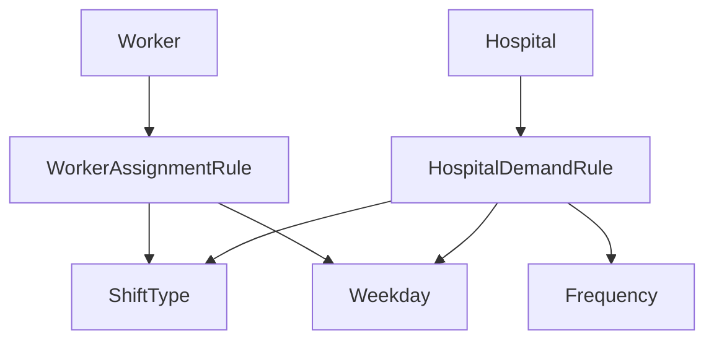

# ドメイン型 API ドキュメント

このドキュメントでは、勤務表自動生成システムで使用される核となるドメイン型について包括的な説明を提供します。

## 概要

ドメイン層は、勤務割り当てシステムにおけるビジネス概念を表現する基本的なデータ構造と列挙型を定義しています。これらの型は、型安全性と明確なデータモデリングを確保するため、アプリケーション全体で使用されます。

## 列挙型

### ShiftType（シフト型）

システムで利用可能な異なる勤務シフトの種類を表現します。

```python
class ShiftType(str, Enum):
    DAY = "日勤"     # 日勤
    NIGHT = "当直"   # 当直・夜勤
    AM = "AM"        # 午前勤務
    PM = "PM"        # 午後勤務
```

**用途：**

- 勤務者の割り当てと病院の需要でシフトの種類を指定
- 簡単なシリアライゼーションと設定のための文字列ベース列挙型
- UI表示互換性のための日本語値

**例：**

```python
shift = ShiftType.NIGHT
print(shift)  # 出力: "当直"
```

### Weekday（曜日）

日本語ローカライゼーション対応の曜日を表現します。

```python
class Weekday(str, Enum):
    MONDAY = "月曜"
    TUESDAY = "火曜"
    WEDNESDAY = "水曜"
    THURSDAY = "木曜"
    FRIDAY = "金曜"
    SATURDAY = "土曜"
    SUNDAY = "日曜"
```

**用途：**

- 割り当てルールと需要仕様で使用
- 日本語化された曜日表現を可能にする
- 曜日固有の制約ロジックをサポート

### Frequency（頻度）

特定の需要ルールがどのくらいの頻度で適用されるかを定義します。

```python
class Frequency(str, Enum):
    WEEKLY = "毎週"      # 毎週
    BIWEEKLY = "隔週"    # 隔週
    SPECIFIC_DAYS = "指定日"  # 特定の指定日
```

**用途：**

- 病院需要のスケジューリングパターンを制御
- 柔軟な需要設定をサポート
- 最適化制約生成で使用

## データクラス

### WorkerAssignmentRule（勤務者割り当てルール）

勤務者がスケジュールされる可能性のある割り当てを定義します。

```python
@dataclass
class WorkerAssignmentRule:
    hospital: str                    # 病院名
    weekdays: list[Weekday]         # 勤務可能な曜日
    shift_type: ShiftType           # 対応可能なシフト種別
```

**属性：**

- `hospital`: 勤務者が割り当て可能な病院名
- `weekdays`: 勤務者が利用可能な曜日のリスト
- `shift_type`: 勤務者が実行可能なシフトの種類

**用途：**

- 勤務者の利用可能性制約を表現
- 有効な割り当てを制限するための制約生成で使用
- 柔軟な勤務者スケジューリング機能を可能にする

**例：**

```python
rule = WorkerAssignmentRule(
    hospital="中央病院",
    weekdays=[Weekday.MONDAY, Weekday.WEDNESDAY, Weekday.FRIDAY],
    shift_type=ShiftType.NIGHT
)
```

### Worker（勤務者）

勤務に割り当てられる医療従事者を表現します。

```python
@dataclass
class Worker:
    name: str                                    # 勤務者名
    assignments: list[WorkerAssignmentRule]     # 可能な割り当てルール
    is_diagnostic_specialist: bool = False      # 専門医フラグ
```

**属性：**

- `name`: 勤務者の一意な識別子/名前
- `assignments`: 勤務者がいつどこで働けるかを定義する可能な割り当てルールのリスト
- `is_diagnostic_specialist`: 専門的な業務の資格があるかを示すブール値フラグ（大学病院の休日当直に影響）

**用途：**

- 最適化モデルの中心的エンティティ
- 割り当ての決定変数を生成するために使用
- 専門医ステータスは制約適用に影響

**例：**

```python
worker = Worker(
    name="田中医師",
    assignments=[
        WorkerAssignmentRule("中央病院", [Weekday.MONDAY], ShiftType.DAY),
        WorkerAssignmentRule("大学病院", [Weekday.FRIDAY], ShiftType.NIGHT)
    ],
    is_diagnostic_specialist=True
)
```

### HospitalDemandRule（病院需要ルール）

病院がスタッフカバレッジを必要とするタイミングを定義します。

```python
@dataclass
class HospitalDemandRule:
    shift_type: ShiftType           # 必要なシフトの種類
    weekdays: list[Weekday]         # カバレッジが必要な曜日
    frequency: Frequency            # ルールが適用される頻度
```

**属性：**

- `shift_type`: カバレッジが必要なシフトの種類
- `weekdays`: シフトが必要な曜日
- `frequency`: スケジューリング頻度（毎週、隔週、または特定日）

**用途：**

- 病院のスタッフ配置要件を定義
- 最適化で需要制約を生成するために使用
- 柔軟なスケジューリングパターンをサポート

**例：**

```python
demand = HospitalDemandRule(
    shift_type=ShiftType.NIGHT,
    weekdays=[Weekday.SATURDAY, Weekday.SUNDAY],
    frequency=Frequency.WEEKLY
)
```

### Hospital（病院）

勤務割り当てが必要な医療施設を表現します。

```python
@dataclass
class Hospital:
    name: str                                # 病院名
    is_remote: bool                         # 遠隔地フラグ
    is_university: bool                     # 大学病院フラグ
    demand_rules: list[HospitalDemandRule]  # スタッフ配置要件
```

**属性：**

- `name`: 病院の一意な識別子/名前
- `is_remote`: 遠隔地にある病院かを示す（当直後の勤務制約に影響）
- `is_university`: 大学病院かを示す（専門医要件に影響）
- `demand_rules`: スタッフ配置需要パターンのリスト

**用途：**

- 最適化におけるスタッフ配置需要ポイントを表現
- 病院フラグは制約ロジックに影響（遠隔地ルール、大学専門医要件）
- 需要側モデリングの中核

**例：**

```python
hospital = Hospital(
    name="大学医療センター",
    is_remote=False,
    is_university=True,
    demand_rules=[
        HospitalDemandRule(ShiftType.NIGHT, [Weekday.FRIDAY], Frequency.WEEKLY),
        HospitalDemandRule(ShiftType.DAY, [Weekday.MONDAY, Weekday.TUESDAY], Frequency.WEEKLY)
    ]
)
```

## 型の関係図



## 設計原則

1. **不変性**: すべてのデータクラスは不変なデータ構造のために`@dataclass`デコレータを使用
2. **型安全性**: 全体を通じて明示的な型ヒントによる強い型付け
3. **ローカライゼーション**: UI互換性のための日本語文字列値
4. **柔軟性**: ルールベースシステムにより複雑なスケジューリングパターンを可能にする
5. **制約対応**: 制約システム要件をサポートする設計

## ペナルティレポートシステム

### 制約サマリー機能

各制約に`summary`属性が追加され、ペナルティレポート用の人間が読みやすい説明が提供されるようになりました：

```python
class ConstraintBase(ABC):
    name: str = "unnamed"                    # 制約識別子
    summary: str = "no summary"              # 人間が読みやすい説明
    requires: ClassVar[set[str]] = set()     # 必要なコンテキストキー
```

**目的：**

- ペナルティレポートで意味のある説明を提供
- どの制約が違反されているかをユーザーが理解できるようにする
- 制約説明の日本語ローカライゼーションをサポート

### ペナルティレポートデータ構造

ペナルティレポートシステムは以下のデータ構造を使用します：

```python
@dataclass
class PenaltyItem:
    var: pulp.LpVariable       # ペナルティ付き決定変数
    weight: float              # ペナルティ重み
    meta: dict[str, Any]       # 追加メタデータ
    source: str               # ペナルティを生成した制約名
```

**レポート生成：**

- 制約サマリー別にペナルティを集約して分析
- 個別ペナルティ項目の詳細な内訳を表示
- 総ペナルティスコアと制約別合計を計算
- ペナルティの重要度による絞り込みと並び替えをサポート

**制約サマリーの例：**

```python
class RespectPreferencesFromCSV(ConstraintBase):
    name = "respect_preferences_from_csv"
    summary = "勤務希望.CSVの内容を遵守"
    requires: ClassVar[set[str]] = {"preferences"}
```

### レポート出力形式

ペナルティレポートシステムは以下を含むリッチなコンソール出力を生成します：

1. **サマリーテーブル**: 制約サマリー別にグループ化された総ペナルティ
2. **詳細テーブル**: メタデータ付きの個別ペナルティ項目
3. **合計値**: 全体のペナルティスコアと制約別内訳

### レポートの解釈例

**サマリーセクション：**

```
                              Penalty Summary                               
┏━━━━━━━━━━━━━━━━━━━━━━━━━━━━━━━━━━━━━━━━━━━━━┳━━━━━━━━━━━━━━━━━━━━━━━━━━━━━━━━━━━┓
┃ 制約                                    ┃ 合計                          ┃
┣━━━━━━━━━━━━━━━━━━━━━━━━━━━━━━━━━━━━━━━━━━━━━╋━━━━━━━━━━━━━━━━━━━━━━━━━━━━━━━━━━━┫
┃ 夜勤間隔を空けたい                      ┃ 15.450                        ┃
┃ 勤務希望.CSVの内容を遵守                ┃ 8.000                         ┃
┃ 平日の非夜勤のバランス                  ┃ 3.200                         ┃
┗━━━━━━━━━━━━━━━━━━━━━━━━━━━━━━━━━━━━━━━━━━━━━┻━━━━━━━━━━━━━━━━━━━━━━━━━━━━━━━━━━━┛
```

**詳細セクション：**

```
                                  Penalty Items (Top 30)                                   
┏━━━┳━━━━━━━━━━━━━━━━━━━━━━━━━━━━┳━━━━━━━━━━━━━━━━━━━━━━━━━━━━━━━━━┳━━━━━┳━━━━━━━━┳━━━━━━━━┳━━━━━━━━━┓
┃ # ┃ 制約                       ┃ 変数                          ┃ 値  ┃ 重み   ┃ ペナルティ┃ メタ   ┃
┣━━━╋━━━━━━━━━━━━━━━━━━━━━━━━━━━━╋━━━━━━━━━━━━━━━━━━━━━━━━━━━━━━━━━╋━━━━━╋━━━━━━━━╋━━━━━━━━╋━━━━━━━━━┫
┃ 1 ┃ 夜勤間隔を空けたい         ┃ night_spacing_violation_Dr... ┃ 2.0 ┃ 5.0    ┃ 10.0   ┃ w=Dr... ┃
┃ 2 ┃ 勤務希望.CSVの内容を遵守   ┃ preference_violation_2025...  ┃ 1.0 ┃ 8.0    ┃ 8.0    ┃ d=10/15 ┃
┗━━━┻━━━━━━━━━━━━━━━━━━━━━━━━━━━━┻━━━━━━━━━━━━━━━━━━━━━━━━━━━━━━━━━┻━━━━━┻━━━━━━━━┻━━━━━━━━┻━━━━━━━━━┛
```

## 統合に関する注意事項

- これらの型は型チェックのため制約システム全体で使用される
- 文字列列挙値は設定ファイルとUIで使用される
- データクラスは設定読み込みのためのシリアライゼーションをサポート
- 病院と勤務者のフラグは専門的な制約ロジックを可能にする
- 制約サマリーは多言語ペナルティレポートをサポート
- ペナルティシステムは詳細なデバッグと最適化の洞察を提供
