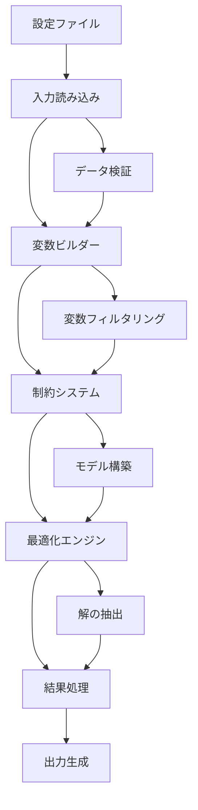

# データフローと統合パターン

このドキュメントでは、勤務表自動生成システム内でのデータフローと外部システム用の統合パターンについて説明します。

## 概要

勤務表自動生成システムは、明確な段階を持つパイプラインアーキテクチャに従います：

1. **入力読み込み** - 設定とデータファイルの解析
2. **変数生成** - 決定変数の作成とフィルタリング
3. **制約適用** - 数理制約の生成
4. **最適化** - PuLPソルバーの実行
5. **出力生成** - 結果のフォーマットとエクスポート



## フェーズ1: 入力読み込み

### データソース

**設定ファイル (TOML)**

- `config/hospitals.toml` → `Hospital`オブジェクト
- `config/workers.toml` → `Worker`オブジェクト
- `data/specified-YYYY-MM.toml` → 指定日オーバーライド

**データファイル (CSV)**

- `data/YYYY-MM.csv` → 勤務者希望
- `data/max-assignments.csv` → 割り当て上限

### 読み込みパイプライン

```python
# src/cli/main.py: build_and_solve()
hospitals = load_hospitals(hospitals_path)          # IOレイヤー
workers = load_workers(workers_path)                # IOレイヤー
specified_days = load_specified_days(specified_days_path)  # IOレイヤー
preferences = load_preferences_csv(preferences_path)        # IOレイヤー
max_assignments = load_max_assignments_csv(max_assignments_path)  # IOレイヤー
days = generate_monthly_dates(year, month)          # カレンダーユーティリティ
```

**データ変換：**

- TOML → ドメインオブジェクト (Hospital, Worker)
- CSV → 辞書マッピング
- 日付計算 → List[date]

### 検証フェーズ

各ローダーは検証を実行します：

- **構造検証**: 必要なフィールド、データ型
- **ビジネスルール検証**: 有効な曜日、シフト型
- **相互参照検証**: 病院/勤務者名の一貫性

## フェーズ2: 変数生成

### 変数ビルダー アーキテクチャ

`VariableBuilder`クラスは、3段階の変数作成プロセスを管理します：

```python
# src/model/variable_builder.py
class VariableBuilder:
    def __init__(self, hospitals, workers, days):
        # デカルト積空間を作成: H × W × D × S
        self.ub: dict[VarKey, int] = defaultdict(int)  # 上限値

    def init_all_zero(self):
        # すべての組み合わせを利用不可として初期化 (UB=0)

    def elevate_by_workers(self, workers):
        # 勤務者定義の利用可能性についてUB=1に設定

    def restrict_by_hospitals(self, hospitals, specified_days):
        # 病院がサポートしない組み合わせについてUB=0にリセット

    def materialize(self):
        # UB=1の組み合わせのみPuLP変数を作成
```

### 変数空間の削減

**初期空間:** `|H| × |W| × |D| × |S|`組み合わせ

**段階1 - 勤務者による引き上げ:**

```python
for worker in workers:
    for assignment_rule in worker.assignments:
        for day in days:
            if day.weekday() in assignment_rule.weekdays:
                ub[VarKey(assignment_rule.hospital, worker.name, day, assignment_rule.shift)] = 1
```

**段階2 - 病院による制限:**

```python
for hospital in hospitals:
    for demand_rule in hospital.demand_rules:
        # 頻度パターン適用 (WEEKLY, BIWEEKLY, SPECIFIC_DAYS)
        # 非当直シフトについて祝日でフィルタリング
        # 不要な(日, シフト)組み合わせについてUB=0にリセット
```

**最終空間:** 実行可能な割り当て組み合わせのみ（通常、初期空間の5-15%）

### 変数キー構造

```python
VarKey = tuple[str, str, date, ShiftType]  # (病院, 勤務者, 日付, シフト)

# 例：
VarKey("中央病院", "田中医師", date(2025,10,15), ShiftType.NIGHT)
VarKey("遠隔クリニック", "佐藤医師", date(2025,10,16), ShiftType.DAY)
```

## フェーズ3: 制約適用

### 制約の発見と登録

```python
# src/constraints/autoimport.py - 動的読み込み
auto_import_all()  # すべての制約モジュールをインポート

# 各制約モジュールは自動登録：
# src/constraints/c01_one_person_per_hospital.py
register(OnePersonPerHospital())  # グローバルレジストリに追加
```

### コンテキスト組み立て

```python
# src/cli/main.py
ctx = Context(
    hospitals=hospitals,
    workers=workers,
    days=days,
    specified_days=specified_days,
    preferences=preferences,
    max_assignments=max_assignments,
    required_hd=compute_required_hd(...),  # 派生データ
    variables=x,
)
```

### 制約適用パイプライン

```python
for constraint in all_constraints():
    constraint.apply(model, x, ctx)  # 各々がPuLPモデルにルールを追加
```

**ハード制約** → PuLP等式/不等式制約
**ソフト制約** → コンテキストにペナルティ項を追加

## フェーズ4: 最適化

### モデル準備

```python
# src/optimizer/objective.py
base_obj = pulp.lpSum(x.values())  # 割り当て数を最大化
set_objective_with_penalties(model, base_obj, ctx)  # ペナルティ項を追加
```

### ソルバー実行

```python
# src/optimizer/solver.py
def solve(model, x, ctx):
    solver = pulp.PULP_CBC_CMD(msg=False)  # CBCソルバー
    start = time.time()
    status_code = model.solve(solver)
    end = time.time()

    # 解を抽出
    assignment = {key: round(pulp.value(var) or 0) for key, var in x.items()}
```

### 解の処理

```python
# 結果集約
total_penalty, by_source, rows = summarize_penalties(ctx)
result = SolveResult(
    status=status,
    objective_value=objective_value,
    assignment=assignment,
    penalty_breakdown=by_source,
    solve_time=elapsed
)
```

## フェーズ5: 出力生成

### コンソール出力パイプライン

```python
# src/cli/main.py
if json_out:
    print(json.dumps(result.to_dict(), default=str))
else:
    print_report_rich(result)        # リッチテーブル
    print_penalties_rich(ctx)        # ペナルティ内訳
```

### Excelエクスポート パイプライン

```python
# src/io/export_excel.py
if xlsx:
    export_schedule_to_excel(
        assignment=result.assignment,
        days=days,
        hospital_names=[h.name for h in hospitals],
        out_path=xlsx
    )
```

## データ構造とフロー

### コアデータ型

```python
# 入力型
Hospital: name, is_remote, is_university, demand_rules[]
Worker: name, assignments[], is_diagnostic_specialist
WorkerAssignmentRule: hospital, weekdays[], shift_type

# 中間型
VarKey: (hospital, worker, date, shift)
Context: すべての入力データ + 派生データ + ペナルティ
LpVariable: PuLP最適化変数

# 出力型
SolveResult: status, assignment{}, penalties{}, metrics
Assignment: {VarKey: 0|1} マッピング
```

### データ変換

**設定 → ドメインオブジェクト:**

```
TOML/CSVファイル → Pythonオブジェクト → 検証 → ドメインモデル
```

**ドメイン → 最適化:**

```
ドメインモデル → 変数空間 → 制約生成 → PuLPモデル
```

**解 → 出力:**

```
PuLP解 → 割り当てマッピング → リッチフォーマット → コンソール/Excel
```

## 統合パターン

### ファイルベース統合

**入力統合:**

```bash
# 外部システムが希望を生成
external_system --output data/2025-10.csv

# 勤務表生成システムが処理
uv run -m src.cli.main --preferences data/2025-10.csv ...
```

**出力統合:**

```bash
# 後続処理用JSON生成
uv run -m src.cli.main --json > schedule.json

# 外部システムで処理
external_processor --input schedule.json
```

### API統合パターン

```python
# プログラム使用例
from src.cli.main import build_and_solve
import tempfile
import json

def generate_schedule_api(config_data):
    # 一時設定ファイルを書き込み
    with tempfile.NamedTemporaryFile(mode='w', suffix='.csv') as prefs:
        # 希望CSVを書き込み
        result = build_and_solve(
            year=2025, month=10,
            preferences_path=prefs.name,
            json_out=True
        )
    return json.loads(result)
```

### データベース統合パターン

```python
# カスタムローダー統合
def load_preferences_from_db(connection, year, month):
    query = "SELECT worker, date, shift, preference FROM preferences WHERE ..."
    rows = connection.execute(query, (year, month)).fetchall()

    # システムが期待するCSV形式に変換
    preferences = {
        (row['worker'], row['date'], row['shift']): row['preference']
        for row in rows
    }
    return preferences

# メインパイプラインでの統合
preferences = load_preferences_from_db(db_conn, year, month)
ctx = Context(..., preferences=preferences, ...)
```

## パフォーマンス特性

### スケーリングパターン

**線形スケーリング:**

- 日数 (D): O(D)
- ファイルI/O操作: O(ファイル数)

**二次スケーリング:**

- 制約生成: ほとんどの制約でO(W×H×D)
- 変数空間: フィルタリング前O(W×H×D×S)

**指数スケーリング:**

- 最適化複雑度: 変数数において指数的（問題構造により軽減）

### メモリ使用量

**入力読み込み:** O(H + W + D) - 入力サイズに線形
**変数生成:** O(実行可能変数) - フィルタリング後
**制約ストレージ:** O(制約数) - 制約複雑性に依存  
**解ストレージ:** O(変数数) - 割り当てマッピング

### 最適化パフォーマンス

**典型的パフォーマンス:**

- 10勤務者 × 5病院 × 30日: ~2-10秒
- 20勤務者 × 10病院 × 30日: ~30-120秒
- フィルタリング後の変数: ~500-2000（潜在的100,000+から）

**パフォーマンス要因:**

- 勤務者-病院割り当ての複雑さ
- アクティブな制約数
- ソルバー効率（CBCデフォルト）
- 制約のスパース性

## エラーハンドリングと復旧

### 入力検証エラー

```python
try:
    hospitals = load_hospitals(path)
except ValidationError as e:
    print(f"病院設定エラー: {e}")
    return 1
```

### 最適化失敗

```python
if result.status_code != pulp.LpStatusOptimal:
    print(f"最適化失敗: {result.status}")
    print("制約の実行可能性を確認してください")
    return 1
```

### 出力生成エラー

```python
try:
    export_schedule_to_excel(...)
except PermissionError:
    print("Excelファイルが書き込めません - 権限を確認してください")
except Exception as e:
    print(f"エクスポート失敗: {e}")
```

## 監視と可観測性

### パフォーマンス指標

- 解決時間の追跡
- 変数数の最適化
- 制約違反数
- メモリ使用パターン

### デバッグ情報

- 制約別ペナルティ内訳
- 非実行可能性分析
- 変数使用率
- 制約拘束分析

このアーキテクチャは、明確な関心の分離と明確に定義された統合ポイントを持つ、堅牢で拡張可能な勤務スケジュール最適化の基盤を提供します。
